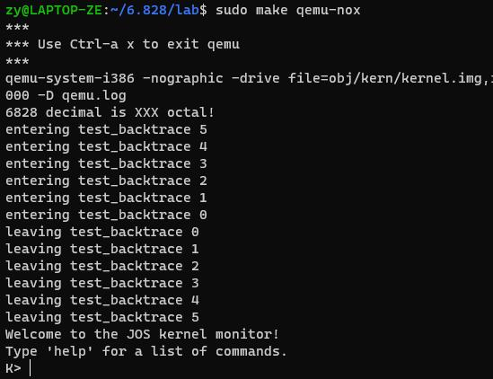

[Lab1官方指南](https://pdos.csail.mit.edu/6.828/2018/labs/lab1/#Exercise-1)

<!--more-->

## 环境搭建
Windows+WSL

1. 在WSL中执行uname -a，返回结果中包含i386 GNU/Linux 或 i686 GNU/Linux 或 x86_64 GNU/Linux，则表示系统环境符合条件。

2. 下载源码 
  ```shell
   git clone https://pdos.csail.mit.edu/6.828/2018/jos.git lab
   ```
3. 按照[tool page](https://pdos.csail.mit.edu/6.828/2018/tools.html)的指引安装编译巩固
   1. 执行以下命令
      ```shell
      objdump -i
      gcc -m32 -print-libgcc-file-name
      ```
    如果命令行输出/usr/lib/gcc/i486-linux-gnu/version/libgcc.a 或者 /usr/lib/gcc/x86_64-linux-gnu/version/32/libgcc.a，表示编译工具链已经安装好了

    2.  如果上一步没有得到预期的输出，需要自己安装编译工具
    ```shell
    sudo apt-get install -y build-essential gdb
    ```
### 安装QEMU 
```shell
git clone https://github.com/mit-pdos/6.828-qemu.git qemu

cd qemu
```
```shell
 ./configure --disable-kvm --disable-werror --target-list="i386-softmmu x86_64-softmmu"
```
```shell
make && make install
```
```shell
cd ../lab
make
make qemu
```


### 异常及解决方式

ERROR: Python not found. Use --python=/path/to/python
{:.error}
> 解决方法：安装python2.7（不支持python2.4之前的版本和python3），然后执行./configure --disable-kvm --disable-werror --target-list="i386-softmmu x86_64-softmmu" --python=python2.7


ERROR: glib-2.12 gthread-2.0 is required to compile QEMU 
{:.error}
{:.error}

> 解决方法：sudo apt-get install libsdl1.2-dev

ERROR: pixman >= 0.21.8 not present. Your options:
         (1) Preferred: Install the pixman devel package (any recent
             distro should have packages as Xorg needs pixman too).
         (2) Fetch the pixman submodule, using:
             git submodule update --init pixman
    {:.error}
> 解决方法： sudo apt-get install libpixman-1-dev

make报错：
LINK  qemu-ga
/usr/bin/ld: qga/commands-posixo: infunction dev_major_minor:
/home/zy/6.828/qemu/qgacommands-posixc:633: undefinedreference to major
/usr/bin/ld: /home/zy/6.828/qemuqgacommands-posix.c:634:undefinedreference to minor
collect2: error: ld returned 1exitstatus
make: *** [Makefile:288:qemu-ga] Error 1
{:.error}

> 解决方法：在./qga/commands-posix.c文件中加上头文件sys/sysmacros.h

make报错：
install -d -m 0755 "/usr/local/share/qemu"
install: cannot change permissions of ‘/usr/local/share/qemu’: No such file or directory
make: *** [Makefile:382: install-datadir] Error 1
{:.error}

> 解决方法：sudo make && make install
  
回到lab目录下执行make报错
lib/printfmt.c:41: undefined reference to ’__udivdi3' ld: lib/printfmt.c:49: undefined reference to ‘__umoddi3' make: *** [kern/Makefrag:71: obj/kern/kernel] Error 1
{:.error}

> sudo apt-get install gcc-multilib

make qemu报错
qemu-system-i386 -drive file=obj/kern/kernel.img,index=0,media=disk,format=raw -serial mon:stdio -gdb tcp::25000 -D qemu.log
Could not initialize SDL(No available video device) - exiting
make: *** [GNUmakefile:156: qemu] Error 1
{:.error}

> WSL没有图形界面，所以会报错，可以用make qemu-nox命令替代，成功后效果如下

按Ctrl+a，然后按x退出qemu

## 参考链接
https://www.cnblogs.com/gatsby123/p/9746193.html

https://www.cnblogs.com/w-a-n-s-d-j/p/16987070.html

https://blog.csdn.net/icekittenice/article/details/102596537

https://www.6hu.cc/archives/120970.html
