[Lab1官方指南](https://pdos.csail.mit.edu/6.828/2018/labs/lab1/#Exercise-1)

<!--more-->

## 环境搭建
Windows+WSL

### 基础环境
1. 在WSL中执行uname -a，返回结果中包含i386 GNU/Linux 或 i686 GNU/Linux 或 x86_64 GNU/Linux，则表示系统环境符合条件。


https://sincerejoy.github.io/2023/04/assets/images/post8-1.jpg
1. 下载源码 
  ```shell
   git clone https://pdos.csail.mit.edu/6.828/2018/jos.git lab
   ```
1. 按照[tool page](https://pdos.csail.mit.edu/6.828/2018/tools.html)的指引安装编译工具
2. 执行以下命令
  ```shell
  objdump -i
  gcc -m32 -print-libgcc-file-name
  ```
  如果命令行输出/usr/lib/gcc/i486-linux-gnu/version/libgcc.a 或者 /usr/lib/gcc/x86_64-linux-gnu/version/32/libgcc.a，表示编译工具链已经安装好了

1. 如果上一步没有得到预期的输出，需要自己安装编译工具
  ```shell
  sudo apt-get install -y build-essential gdb
  ```

### 安装QEMU 

```shell
git clone https://github.com/mit-pdos/6.828-qemu.git qemu
cd qemu
```

```shell
 ./configure --disable-kvm --disable-werror --target-list="i386-softmmu x86_64-softmmu"
```
```shell
make && make install
```
```shell
cd ../lab
make
make qemu
```
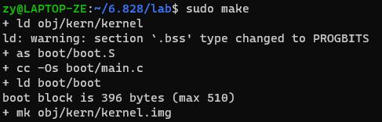

### 异常及解决方式

ERROR: Python not found. Use --python=/path/to/python
{:.error}
> 解决方法：安装python2.7（不支持python2.4之前的版本和python3），然后执行./configure --disable-kvm --disable-werror --target-list="i386-softmmu x86_64-softmmu" --python=python2.7


ERROR: glib-2.12 gthread-2.0 is required to compile QEMU 
{:.error}

> 解决方法：sudo apt-get install libsdl1.2-dev

ERROR: pixman >= 0.21.8 not present. Your options
{:.error}
> 解决方法： sudo apt-get install libpixman-1-dev

make报错：
LINK  qemu-ga
/usr/bin/ld: qga/commands-posixo: infunction dev_major_minor:
/home/zy/6.828/qemu/qgacommands-posixc:633: undefinedreference to major
/usr/bin/ld: /home/zy/6.828/qemuqgacommands-posix.c:634:undefinedreference to minor
collect2: error: ld returned 1exitstatus
make: *** [Makefile:288:qemu-ga] Error 1
{:.error}

> 解决方法：在./qga/commands-posix.c文件中加上头文件sys/sysmacros.h

make报错：
install -d -m 0755 "/usr/local/share/qemu"
install: cannot change permissions of ‘/usr/local/share/qemu’: No such file or directory
make: *** [Makefile:382: install-datadir] Error 1
{:.error}

> 解决方法：sudo make && make install
  
回到lab目录下执行make报错
lib/printfmt.c:41: undefined reference to ’__udivdi3' ld: lib/printfmt.c:49: undefined reference to ‘__umoddi3' make: *** [kern/Makefrag:71: obj/kern/kernel] Error 1
{:.error}

> sudo apt-get install gcc-multilib

make qemu报错
qemu-system-i386 -drive file=obj/kern/kernel.img,index=0,media=disk,format=raw -serial mon:stdio -gdb tcp::25000 -D qemu.log
Could not initialize SDL(No available video device) - exiting
make: *** [GNUmakefile:156: qemu] Error 1
{:.error}

> WSL没有图形界面，所以会报错，可以用make qemu-nox命令替代，成功后效果如下
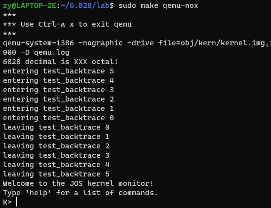

按Ctrl+a，然后按x退出qemu

## PC Bootstrap
第一代个人计算机使用的是16位的Intel 8088处理器，只能对1MB的物理内存进行寻址。因此早期PC的物理地址空间只能从0x00000000到0x000FFFFF。图中640KB的“低内存”空间是早期PC所能使用的全部RAM。

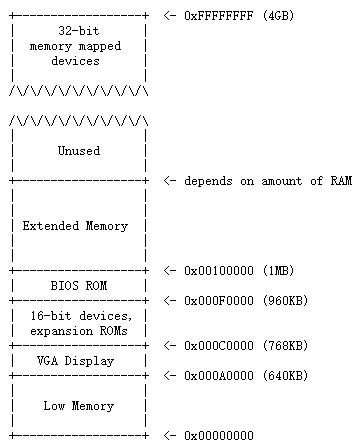

从0x000A0000到0x000FFFFF的384

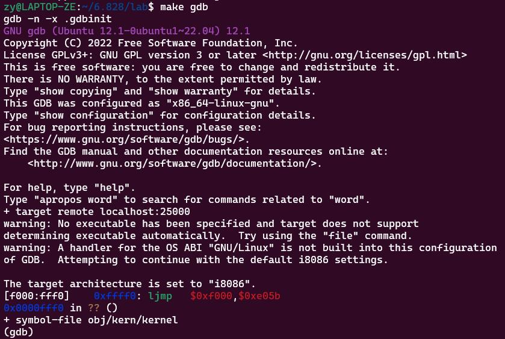

可以看到启动PC后执行的第一条指令是：
```
[f000:fff0] 0xffff0:	ljmp   $0xf000,$0xe05b
```
从中我们可以得出以下信息：
1. IBM PC从物理地址0xffff0处的指令开始执行（0xFFFF0正好比BIOS的结束地址小16位）
2. 该指令从段地址CS=0xf000和偏移地址IP=0xe05b处开始执行
3. 第一条指令是一个ljmp指令(long jump 长转移），跳转到CS:IP=0xf000:0xe05b处的指令

实模式下的物理寻址:
physical address = 16 * segment + offset
                 = 16 * CS + IP
                 = 16 * 0xf000 + 0x0xe05b
                 = 0xf0000 + 0xe05b
                 = 0xfe05b
{:.info}

### EX. 2
启动PC后，用GDB si来追踪ROM BIOS的其他指令，分析他们的作用。

注意AT&T汇编语言中，左边的是源操作数，右边的是目标操作数
```shell
  0xffff0: ljmp   $0xf000,$0xe05b // 跳转到0xfe05b处

  0xfe05b: cmpl   $0x0,%cs:0x6ac8 //比较0x6ac8处的值是否等于0
  0xfe062: jne    0xfd2e1 //上述比较不相等时跳转到0xfd2e1
  0xfe066: xor    %dx,%dx //（上一条指令没有跳转）把dx寄存器清零

  0xfe068: mov    %dx,%ss // ss寄存器的值也设为0
  0xfe06a: mov    $0x7000,%esp // esp寄存器的值设为0x7000
  0xfe070: mov    $0xf34c2,%edx //edx寄存器的值设为0xf34c2
  0xfe076: jmp    0xfd15c // 跳转到0xfd15c
  0xfd15c: mov    %eax,%ecx //把eax寄存器的值赋给ecx寄存器

  0xfd15f: cli // clear interrupt 关闭中断，在启动过程中不会响应硬件中断
  0xfd160: cld // clear direction flag 方向标识位设为0

  0xfd161: mov    $0x8f,%eax // eax寄存器的值设为0x8f
  0xfd167: out    %al,$0x70 // 把al寄存器中的值写入0x70端口，0x70是一个端口地址，0x70和0x71是控制CMOS的端口
  0xfd169: in     $0x71,%al // 读取0x71端口的值到寄存器al中

   // 下面这三条指令相当于把0x92端口值的低1位置为1，bit 1= 1 indicates A20 active，A20地址线被激活，进入保护模式
   // 但BIOS其实是要工作在实模式下的，这里只是测试能否正常进入保护模式
  0xfd16b: in     $0x92,%al // 读取0x92端口的值到寄存器al中，0x92端口控制的是PS/2系统控制端口A
  0xfd16d: or     $0x2,%al // 对寄存器al中的值和0x2按位或
  0xfd16f: out    %al,$0x92 //  把上一步得到的寄存器al的值重新写入0x92端口

  0xfd171: lidtw  %cs:0x6ab8 // 把从地址0xf6ab8起始的后面6个字节的数据读入到中断向量表寄存器(IDTR)中
  0xfd177: lgdtw  %cs:0x6a74 // 把从0xf6a74为起始地址处的6个字节的值加载到全局描述符表寄存器(GDTR)中

  // 下面这三条指令相当于把CR0寄存器的最低位置为1，CR0寄存器的0bit是PE位，启动保护位，当该位被置1，代表开启了保护模式
  // 但BIOS其实是要工作在实模式下的，这里只是测试能否正常进入保护模式
  0xfd17d: mov    %cr0,%eax
  0xfd180: or     $0x1,%eax
  0xfd184: mov    %eax,%cr0
```
BIOS主要执行的操作是初始化和检测系统设备，最后找到操作系统存储的设备（磁盘），然后通过boot loader把操作系统从磁盘中导入内存。

## Part 2: The Boot Loader
可启动的磁盘中的第一个扇区存储了boot loader的代码，当BIOS找到了存储了操作系统的软盘或者硬盘时，它会把第一个512字节的启动扇区加载到内存的0x7c00~0x7dff地址处，然后用jmp指令跳转到CS:IP=0000:7c00，最后把控制权交给boot loader。

### boot loader的主要操作
1. 首先boot loader从实模式切换到32位的保护模式，只有在保护模式下，软件才能够访问处理器物理内存中1MB以上的地址空间。注意在保护模式下寻址的偏移量不再是16位，而是32位（CS*32+IP)。
2. 然后boot loader通过x86的特殊I/0指令直接从硬盘中读取内核

### Ex. 3
用GDB调试boot/boot.S和boot/main.c源码，回答以下问题
* At what point does the processor start executing 32-bit code? What exactly causes the switch from 16- to 32-bit mode?
boot.S中

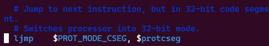

* What is the last instruction of the boot loader executed, and what is the first instruction of the kernel it just loaded?
  
  boot loader最后执行的语句是bootmain中的最后一条指令，该指令的作用是跳转到内核程序的起始处，
  
  

  首先通过boot.asm找到上述指令的地址，然后在GDB中打断点，再执行一次si命令得到跳转到kernal后执行的第一条指令

  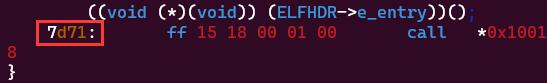
  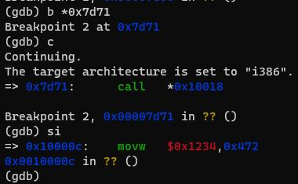

* Where is the first instruction of the kernel?
  
  从上个问题的结果可以看到内核的第一条指令在地址0x10000c处

* How does the boot loader decide how many sectors it must read in order to fetch the entire kernel from disk? Where does it find this information?
  
  操作系统内核映像文件的ELF Header中有Program Header Table的地址信息，PHT中的每个表项分别对应操作系统的一个段。并且每个表项的内容包括这个段的大小、段起始地址偏移等信息。

### Ex. 4
这个练习用来帮助我们熟悉c语言中指针的使用，下载并运行[pointers.c](https://pdos.csail.mit.edu/6.828/2018/labs/lab1/pointers.c)，输出结果如下
```
1: a = 0x7ffdc9ace8a0, b = 0x55ed194202a0, c = 0x7ffdc9acebf9
2: a[0] = 200, a[1] = 101, a[2] = 102, a[3] = 103
3: a[0] = 200, a[1] = 300, a[2] = 301, a[3] = 302
4: a[0] = 200, a[1] = 400, a[2] = 301, a[3] = 302
5: a[0] = 200, a[1] = 128144, a[2] = 256, a[3] = 302
6: a = 0x7ffdc9ace8a0, b = 0x7ffdc9ace8a4, c = 0x7ffdc9ace8a1
```
重点需要理解第1、6行的地址是如何得到的，第2-4行的值是如何得到的，以及第5行为什么会出现一个异常值

* 第一行：0x7ffdc9ace8a0是数组a的首地址，0x55ed194202a0是b所占有的内存空间的起始地址，0x7ffdc9acebf9是指针c指向的地址
* 第二行：c=a令指针c指向了数组a的起始地址，for循环中的代码把数组a中的值分别设为了100、101、102、103，c[0]=200将数组a的第一个元素值设为了200
* 第三行：因为之前已经令c指向了数组a的首地址，因此c[1]相当于\*(c+1)，指向数组a的1号元素，\*(c+2)则相当于c[2]，3[c]相当于c[3]
* 第四行：c = c+1,将c指针后移四字节，指向数组a的第一个元素
* 第五行：c = (int *)((char *)c + 1) 先将整型指针c强制转换成字符类型指针，此时再+1，指针只会后移一字节，然后再强制转换成整形指针，此时c控制的是数组a的1号元素的后3个字节和2号元素的第一个字节，\*c=500把这四个字节的值设为500，a[1],a[2]都受到了影响
* 第六行：b = (int *) a + 1 使得b指向数组a的第一个元素，所以b的地址是a的地址+4，c = (int *) ((char *) a + 1) 和第五行类似，使得c指向a地址后一字节。

### Executable and Linkable Format (ELF) binary
ELF二进制文件都以一个固定长度的ELF头开始，还有有一个变长的程序头（program header），程序头中列出了每个需要被加载的程序区。我们关心的程序区主要有以下三个：
* .text: 存储程序的可执行指令
* .rodata: 存储只读数据
* .data: 程序中已初始化的数据，未初始化的数据都赋值为0并保存在.data后面的.bss区，因为值都为0所以不需要在ELF头中保存它，只需要记录.bss区的地址和大小

### Ex. 5
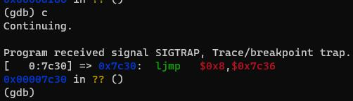

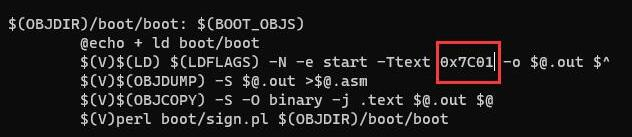

### Ex. 6
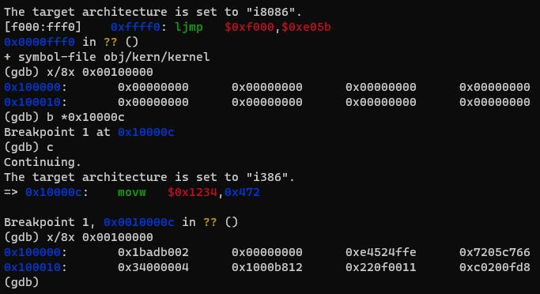

## Part3: The Kernel
boot loader的链接地址和加载地址是一样的，但kernel的链接地址和加载地址间隔很远。

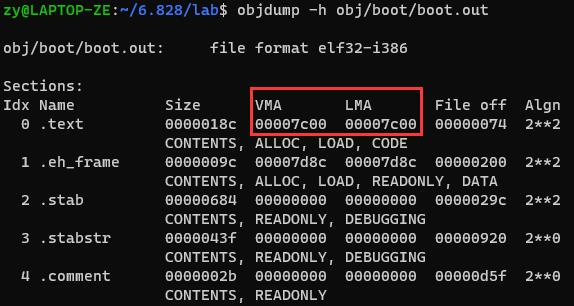

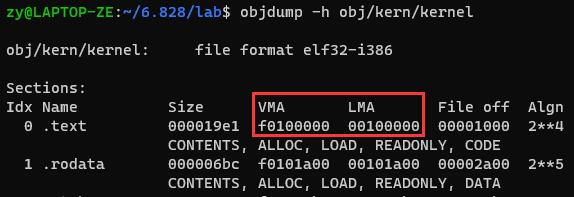

操作系统内核通常在虚拟内存的高地址处运行，把虚拟内存的低地址留给用户程序。很多机器的物理地址无法达到0xf0100000，因此我们把0xf0100000作为虚拟地址映射到物理地址0x00100000，也就是内核的加载地址。

### Ex. 7
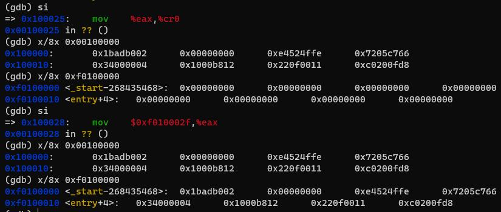

movl %eax, %cr0 指令将0x00100000的值映射到了0xf0100000中，如果在kern/entry.S中将movl %eax, %cr0注释掉，运行会报错，因为地址超出了内存范围。

### 格式化输出到控制台
### Ex. 8
读kern/printf.c, lib/printfmt.c, kern/console.c源码，补全其中缺失的一小部分，实现完整的输出功能，并回答下列问题

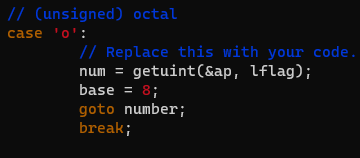

1. 解释printf.c和console.c之间的接口。具体来说console.c导出了哪些函数？printf.c中是如何使用这些函数的?
   printf.c中使用了console.c的cputchar()方法，将它封装成了putch方法，用于在屏幕上打印一个字符。

   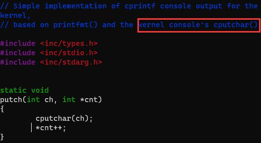

2. 解释以下console.c的代码:
   ```c
    if (crt_pos >= CRT_SIZE) { //超过了屏幕能够显示的最大字符数
      int i;
      memmove(crt_buf, crt_buf + CRT_COLS, (CRT_SIZE - CRT_COLS) * sizeof(uint16_t)); // 删除第一行字符
      //清除最后一行
      for (i = CRT_SIZE - CRT_COLS; i < CRT_SIZE; i++)
              crt_buf[i] = 0x0700 | ' ';
      // 当前写位置前移一行
      crt_pos -= CRT_COLS;
    }
   ``` 
   从console.h中可以看出CRT_ROWS代表CRT屏幕能够容纳的行数，CRT_COLS代表屏幕能够容纳的列数（每行的字符数），CRT_SIZE是整个屏幕能够显示字符数
   ```c
   #define CRT_ROWS  25
   #define CRT_COLS  80
   #define CRT_SIZE  (CRT_ROWS * CRT_COLS)
   ```
   C语言中memmove的声明如下：
   ```c
   void * memmove ( void * destination, const void * source, size_t num );
   ```
   所以console.c中的memmove的作用就是把从第二行（crt_buf + CRT_COLS）开始的(CRT_SIZE - CRT_COLS) * sizeof(uint16_t)长度的数据移动到第一行开始的位置（crt_buf），相当于删除了第一行。此时最后一行依然是原来的数据，因此需要通过for循环清除最后一行。最后把当前写位置前移一行，也就是移动到最后一行。

      
3. 下面的问题可能需要参考Lecture 2关于下x86 GCC调用规则的notes。
     * 逐步调试下面的代码，调用cprintf()时，fmt和ap分别指向了什么？
    ```c
    int x = 1, y = 3, z = 4;
    cprintf("x %d, y %x, z %d\n", x, y, z);
    ```
    把这两行代码添加到 kern/monitor.c的monitor函数中，重新编译内核，再运行make qemu-nox，可以看到如下的效果

    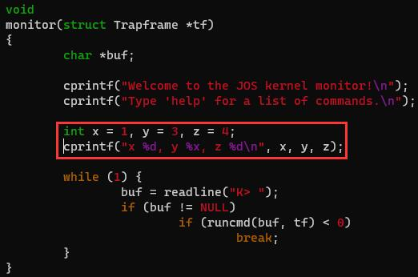
    
    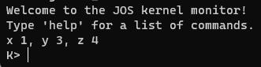

    查看obj/kern/kernel.asm，找到monitor函数对应的反汇编代码
    
    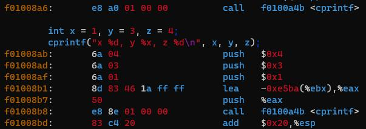

    调用cprintf的指令地址是0xf01008b8，用gdb进行调试，在这个位置打断点，然后逐步调试，可以看到fmt和ap指向的地址，然后用x/nx命令查看地址的内容，fmt指向的是字符串"x %d, y %x, z %d\n"，ap指向的是栈顶，三个参数值是从后往前压栈的。

    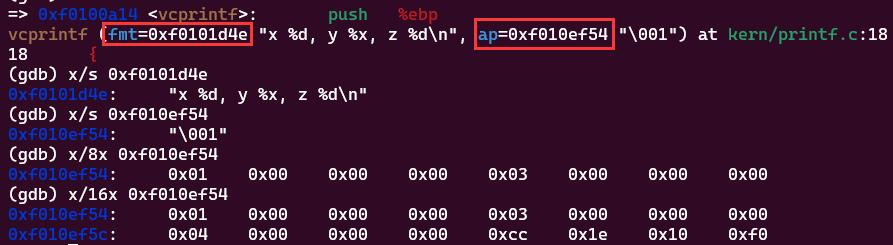

     * 按执行顺序依次列出cons_putc, va_arg, 和vcprintf的每次调用。对于cons_putc, 同时列出它的参数；对于va_arg, 列出执行前后ap指向的变化；对于vcprintf，列出两个参数的值。
      
      还是在调用cprintf的位置打断点，逐步执行，发现首先调用的是vcprintf，参数为vcprintf (fmt=0xf0101d4e "x %d, y %x, z %d\n", ap=0xf010ef54 "\001")，然后调用vprintfmt，vprintfmt中会调用putch，putch调用cputchar, cputchar调用cons_putc，此时参数是c=120,对应ASCII码是'x',执行完后屏幕上会显示'x',之后经过同样的流程打印一个空格，打印我们输入的参数时会调用va_arg, va_arg会调用printnum，printnum会调用putch一位一位地打印输入的参数，putch调用cputchar, cputchar调用cons_putc打印出1，va_arg完成调用后，1从栈中弹出，ap会指向下一个参数，。


4. 运行以下代码
    ```c
    unsigned int i = 0x00646c72;
    cprintf("H%x Wo%s", 57616, &i);
    ```
    输出是什么？解释这个输出是怎么得到的。注意x86是小端序的，如果x86是大端序的话，应该把i设为什么值才能得到相同的输出呢？需要把57616设为其它的值吗？

    还是把这段代码加入到kern/monitor.c的monitor函数中，输出是He110 World。第一个参数57616会被表示为16进制（%x），即e110；第二个参数输出的格式是字符串（%s），参数是i的地址&i，会从i的地址开始读取字符直到读到’\0‘。因为x86是小端序，所以读取的字符依次是'0x72','0x6c','0x64','0x00',对应'r','l','d','\0'。对于大端序，应该把i设置为0x726c6400，57616的值不变。

5. 下列代码中'y='后面会输出什么? 为什么会出现这样的结果?
    ```c
    cprintf("x=%d y=%d", 3);
    ```
    没有指定y的值，所以会输出一个不确定的值，也就是栈中3的地址+1位置的值。
6. 假设GCC改变了它的调用规则，它按照声明的顺序来调用参数，也就是说最后一个参数是最后入栈的。该如何修改cprintf或者它的接口使得它能够接收不同长度的参数列表呢？
   
   将最后一个可变参数设为传入可变参数的个数，或者倒序传入可变参数。

### Challenge
实现彩色输出
T.B.C.

### 栈

esp寄存器保存栈顶指针，指向目前使用过的最低地址，栈顶指针之下的栈区域都是空的。向栈中压入一个值的过程为：栈顶指针下移，然后向指针指向的空间写入值。从栈中弹出一个值的过程为：读取栈顶指针指向区域的值，然后指针上移。在32位系统中，栈只能存储32位的值，%esp存储的地址总是能够被4整除。

ebp寄存器是基址指针，用来记录每一个程序的栈帧信息。每个C函数时开始执行前，都会先把前一个函数（调用该函数的函数）的基址指针压入栈中保存，并将当前esp的值复制到ebp中，以在函数执行期间保持基址指针的正确性（esp以上的地址是不可访问的，相当于规定了栈帧的边界）。如果程序中所有的函数都遵循这个约定，在程序执行过程中的任何时刻，都可以通过追踪保存的ebp指针链来回溯整个栈，并确定导致程序到达特定点的函数调用的嵌套顺序。例如，当某个函数由于传递了错误的参数而导致assert失败或崩溃时，栈回溯可以让你找到是哪个函数传递了错误的参数。

### Ex. 9
内核是在哪里初始化栈的？栈的内存地址是什么？内核是怎么为栈保留内存空间的？栈指针初始化时指向内存地址的哪一端？（高地址端还是低地址端？）

在entry.S中call i386_init指令之前初始化栈的，栈的内存地址是0xf0108000~0xf0110000，在内核数据段预留32KB空间给栈，初始时栈顶指针指向高地址端（0xf0110000），然后向下增长。

### Ex.10
在obj/kern/kernel.asm中找到test_backtrace函数的地址，打断点，查看内核启动后每次调用test_backtrace时发生了什么，每个循环嵌套的test_backtrace函数压入了多少32-bit单词到栈中，这些单词都是什么。

在第70行找到test_backtrace的地址是f0100040，打断点，每次调用时会打印'entering test_backtrace n', 然后嵌套调用test_backtrace(n-1),直到n=0，然后每退出一层嵌套就打印'leaving test_backtrace n'。

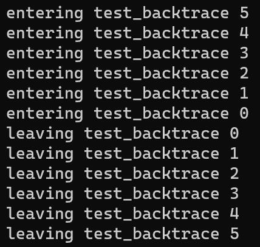

### Ex. 11
实现kern/monitor.c中的mon_backtrace()函数。
```c
int
mon_backtrace(int argc, char **argv, struct Trapframe *tf)
{
        // Your code here.
        uint32_t *ebp;
        ebp = (uint32_t*)read_ebp();
        cprintf("Stack backtrace:\n");
        while(ebp!=0){
                cprintf("  ebp %08x", ebp);
                cprintf("  eip %08x", *(ebp)+1);
                cprintf("  args");
                cprintf(" %08x", *(ebp+2));
                cprintf(" %08x", *(ebp+3));
                cprintf(" %08x", *(ebp+4));
                cprintf(" %08x", *(ebp+5));
                cprintf(" %08x\n", *(ebp+6));
                ebp  = (uint32_t*) *ebp;
        }
        return 0;
}
```
### Ex. 12
改进mon_backtrace，打印每个eip对应的函数名/源文件名/行号。可以用kern/kdebug.c中的debuginfo_eip()获取这些信息，其中寻找行号的部分需要自己实现。

执行objdump -G obj/kern/kernel，可以看到行号对应的stabs type是SLINE，并且行号存储在n_desc字段。

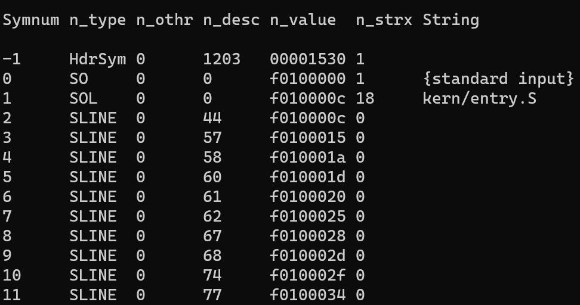
```c
  // Search within [lline, rline] for the line number stab.
  // If found, set info->eip_line to the right line number.
  // If not found, return -1.
  //
  // Hint:
  //      There's a particular stabs type used for line numbers.
  //      Look at the STABS documentation and <inc/stab.h> to find
  //      which one.
  // Your code here.
  stab_binsearch(stabs, &lline, &rline, N_SLINE, addr);
  if(lline>rline){
          return -1;
  }else{
          info->eip_line = stabs[lline].n_desc;
  }
```
然后在monitor.c中添加输出文件名、行号、函数名等信息的代码。注意，STABS表中的字符串是没有'\0'终止符的，lab中提示可以用printf("%.*s", length, string)输出最多length长度的string。

```c
int
mon_backtrace(int argc, char **argv, struct Trapframe *tf)
{
  // Your code here.
  uint32_t *ebp;
  ebp = (uint32_t*)read_ebp();
  int flag;
  struct Eipdebuginfo info;
  cprintf("Stack backtrace:\n");
  while(ebp!=0){
    cprintf("  ebp %08x", ebp);
    cprintf("  eip %08x", ebp[1]);
    cprintf("  args");
    cprintf(" %08x", ebp[2]);
    cprintf(" %08x", ebp[3]);
    cprintf(" %08x", ebp[4]);
    cprintf(" %08x", ebp[5]);
    cprintf(" %08x\n", ebp[6]);
    flag = debuginfo_eip(ebp[1], &info);
    if(!flag){
      cprintf("\t%s:%d: %.*s+%d\n", info.eip_file, info.eip_line, info.eip_fn_namelen, info.eip_fn_name, ebp[1]-info.eip_fn_addr);
    }else{
      cprintf("Failed\n");
    }
    ebp  = (uint32_t*) *ebp;
  }
  return 0;
}
```
测试结果：

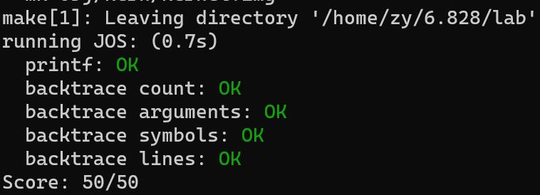

## 参考链接
https://www.cnblogs.com/fatsheep9146/?page=2

https://www.cnblogs.com/gatsby123/p/9746193.html

https://www.cnblogs.com/w-a-n-s-d-j/p/16987070.html
